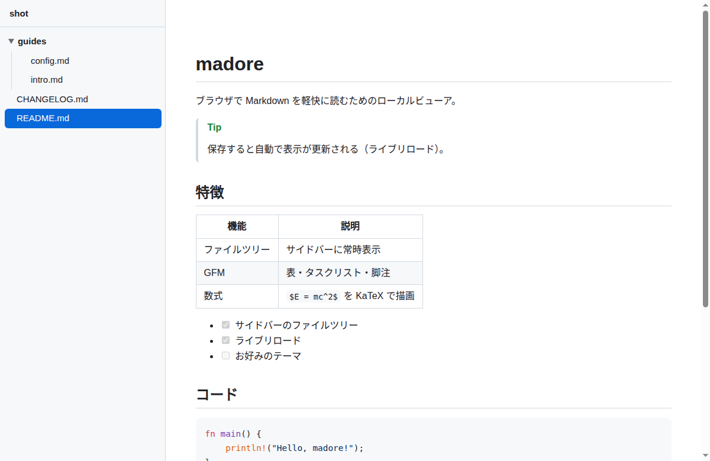

<div align="center">

# madore

**ブラウザで Markdown を軽快に読むためのローカルビューア**

引数なしでもカレントディレクトリをルートにして、サイドバーに最初からファイルツリーを表示。<br>
保存すれば自動でリロード。Rust 製の単一バイナリ。

[](https://github.com/ibuibu/madore/releases)
[](LICENSE)




</div>

## ✨ 特徴

- 📂 **ファイルツリー** — サイドバーに常時表示、クリックで本文へ
- 🔄 **ライブリロード** — 保存を検知して自動で表示更新（SSE）
- 📝 **GitHub Flavored Markdown** — 表 / タスクリスト / 脚注 / GitHub Alerts
- 🎨 **リッチ描画** — シンタックスハイライト・KaTeX 数式・Mermaid 図
- 📦 **単一バイナリ** — 静的アセットを埋め込み、依存なしで配布可能
- 🌗 **ダーク / ライト** — ブラウザ設定に自動追従
- 🚀 **即終了** — サーバーはバックグラウンド常駐、コマンドはすぐ戻る（2回目以降は再利用）

## 📦 インストール

<details open>
<summary><b>インストールスクリプト（Linux / macOS・Rust 不要）</b></summary>

```sh
curl -fsSL https://raw.githubusercontent.com/ibuibu/madore/main/install.sh | sh
```

GitHub Releases から OS に合ったバイナリを取得し `~/.local/bin`（`$MADORE_BIN_DIR` で変更可）へ配置します。

</details>

<details>
<summary><b>プリビルドバイナリを手動でダウンロード</b></summary>

[Releases](https://github.com/ibuibu/madore/releases) からアーカイブを取得し、`madore`（Windows は `madore.exe`）を PATH の通った場所へ。

| OS | アーカイブ |
|----|-----------|
| Linux (x86_64, static musl) | `madore-x86_64-unknown-linux-musl.tar.gz` |
| macOS (Intel) | `madore-x86_64-apple-darwin.tar.gz` |
| macOS (Apple Silicon) | `madore-aarch64-apple-darwin.tar.gz` |
| Windows (x86_64) | `madore-x86_64-pc-windows-msvc.zip` |

</details>

<details>
<summary><b>Cargo（Rust ツールチェーンがある場合）</b></summary>

```sh
cargo install --git https://github.com/ibuibu/madore
```

</details>

## 🚀 使い方

```sh
madore                   # カレントディレクトリをルートに起動（ブラウザが開く）
madore ./docs            # ディレクトリを指定
madore --no-open ./docs  # ブラウザを自動で開かない
madore --stop ./docs     # そのルートのサーバーを停止
```

実行するとサーバーを端末から切り離してバックグラウンド起動し、`http://127.0.0.1:<port>` で配信したままコマンドは終了します。同じルートを再度開くと既存サーバーを再利用します（ポートは `~/.local/state/madore/` に記録）。

## 🛠 仕組み

| 領域 | 役割 |
|------|------|
| サーバー (comrak) | Markdown → GFM 構造の HTML 化 |
| クライアント (vanilla JS) | highlight.js / KaTeX / Mermaid の見た目付与 |

構造化はサーバー側の comrak が担い、色付け・数式・図はクライアント側の JS が後処理します。npm / TypeScript のビルドは使わず、ベンダリングした静的アセットをバイナリに埋め込んでいます。

## 🔧 ソースからビルド

```sh
cargo build --release   # 生成物: target/release/madore
cargo test              # テスト
```

## 📦 リリース

`vX.Y.Z` 形式のタグを push すると、GitHub Actions が各 OS 向けバイナリをビルドして Releases に添付します。

```sh
git tag -a v0.1.0 -m v0.1.0
git push origin v0.1.0
```

## 📄 ライセンス

[MIT](LICENSE)
